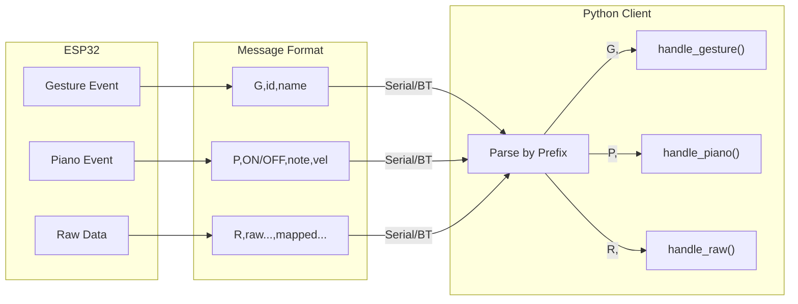

# Vlove System Diagrams

## Figure 1: System Architecture Overview

## Figure 2: Main Control Loop

## Figure 3: Signal Filtering Pipeline

## Figure 4: Calibration Process

## Figure 5: Static Gesture Matching

## Figure 6: Dynamic Gesture State Machine

## Figure 7: Piano Single Note Mode

## Figure 8: Communication Protocol

## Figure 9: Bluetooth Connection Flow

## Figure 10: Audio Synthesis Pipeline

